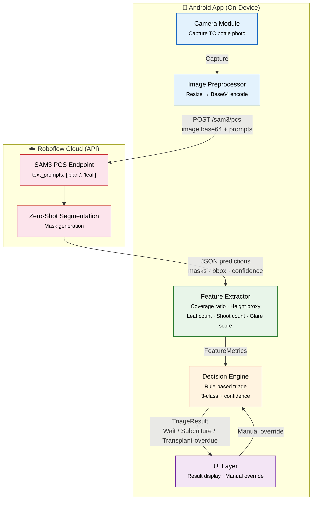
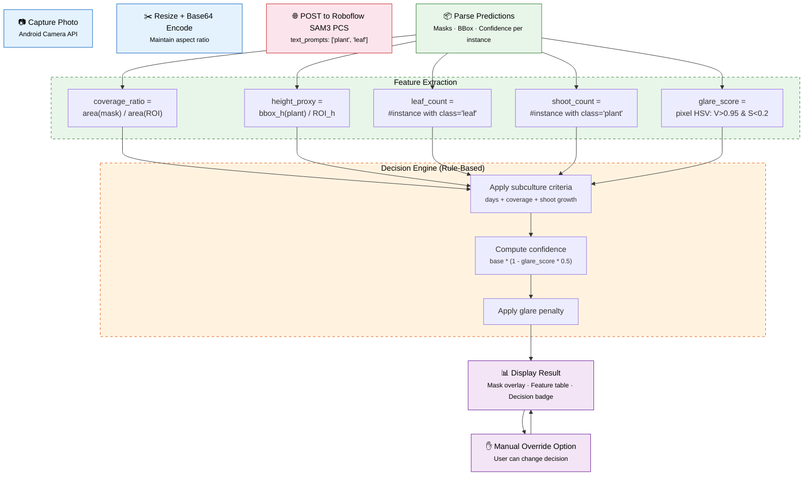
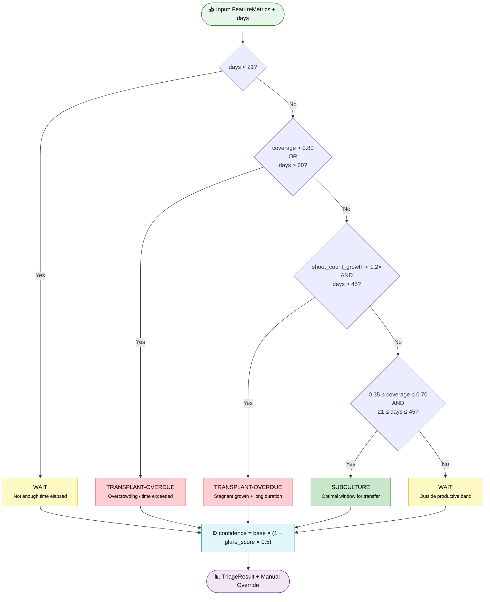
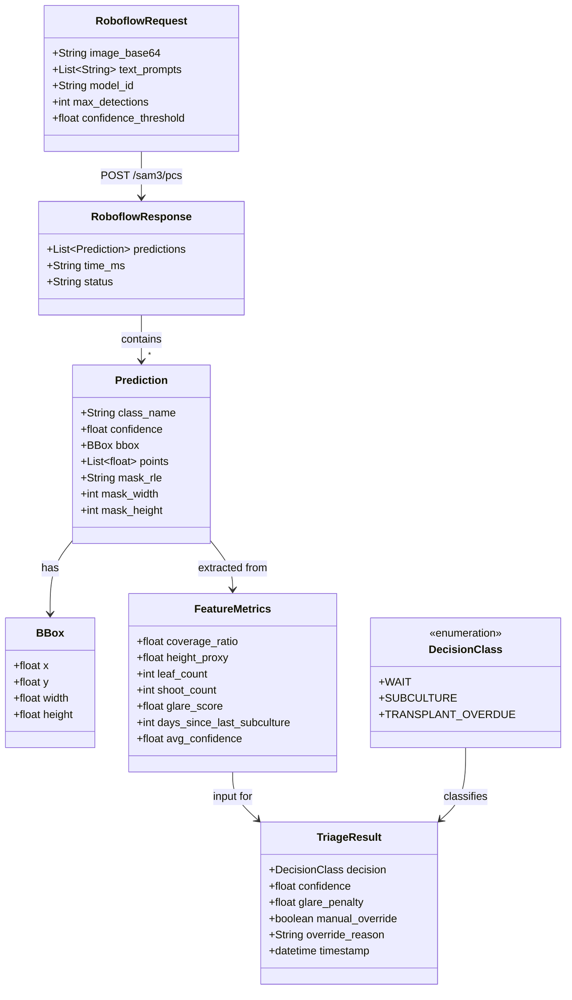

# VitroVision — Architecture & Design Diagrams

> Publication-quality diagrams in Mermaid syntax.
> All labels in English per YSC publication requirement.
> Thai annotations in `%%` comments where design context is needed.

---

## 1. System Architecture Diagram



**Data Flow Summary:**

| Step | Component | Direction | Payload |
|------|-----------|-----------|---------|
| 1 | Camera → Image Preprocessor | local | Raw JPEG/PNG |
| 2 | Image Preprocessor → SAM3 API | HTTP POST | Base64 image + `["plant","leaf"]` |
| 3 | SAM3 API → Feature Extractor | HTTP Response | JSON: predictions, masks (RLE), bbox, confidence |
| 4 | Feature Extractor → Decision Engine | in-memory | FeatureMetrics object |
| 5 | Decision Engine → UI | in-memory | TriageResult with decision class + confidence |

---

## 2. Pipeline / Flowchart



---

## 3. Decision Tree



### Decision Table

| Condition | Decision Class | Color |
|-----------|----------------|-------|
| days < 21 | WAIT | 🟡 Yellow |
| coverage > 0.80 OR days > 60 | TRANSPLANT-OVERDUE | 🔴 Red |
| shoot_count_growth < 1.2× AND days > 45 | TRANSPLANT-OVERDUE | 🔴 Red |
| 0.35 ≤ coverage ≤ 0.70 AND 21 ≤ days ≤ 45 | SUBCULTURE | 🟢 Green |
| Else | WAIT | 🟡 Yellow |

**Confidence Formula:**
```
confidence = base_confidence × (1 − glare_score × 0.5)
```
where `base_confidence` is the model confidence from SAM3 averaged across instances, and `glare_score` ∈ [0, 1] reduces confidence by up to 50%.

---

## 4. Wireframe UI (ASCII Mockup)

### Screen 1 — Main Screen

```
┌────────────────────────────────────┐
│  📱 VitroVision                     │  ← Status bar
│────────────────────────────────────│
│                                    │
│          ┌──────────────┐          │
│          │  VitroVision  │          │  ← App title
│          │   🌱 v2.0    │          │
│          └──────────────┘          │
│                                    │
│    Days since last subculture      │
│    ┌──────────────────────────┐    │
│    │  [  28  ]                │    │  ← Numeric input field
│    └──────────────────────────┘    │
│                                    │
│         ┌──────────────────┐       │
│         │    📸 ถ่ายภาพ     │       │  ← Primary CTA (Thai per UX)
│         └──────────────────┘       │
│                                    │
│    [ℹ] ถ่ายภาพขวดด้านข้าง         │
│        ระยะ 15-20 ซม.              │  ← Instruction text
│                                    │
│    ────── Recent Results ──────    │
│    │ 2026-07-05 → SUBCULTURE  │    │
│    │ 2026-06-28 → WAIT        │    │  ← History (collapsed)
│    └──────────────────────────┘    │
└────────────────────────────────────┘
```

### Screen 2 — Camera

```
┌────────────────────────────────────┐
│  ← Back        VitroVision         │
│────────────────────────────────────│
│                                    │
│    ┌──────────────────────────┐    │
│    │                          │    │
│    │   ┌────────────────┐   ░░░│   │
│    │   │  TC Bottle     │   ░░░│   │  ← Viewfinder with
│    │   │  (live feed)   │      │   │     guide overlay
│    │   │                │      │   │
│    │   └────────────────┘      │   │
│    │                  ░░░░░░░  │   │
│    └──────────────────────────┘    │
│                                    │
│         ┌──────────────────┐       │
│         │   ⭕ ถ่ายภาพ     │       │  ← Capture button
│         └──────────────────┘       │
│                                    │
│    [i] จัดให้ขวดอยู่ในกรอบ        │
├────────────────────────────────────┤
│  Confirm Capture?                  │
│  ┌──────────┐  ┌──────────┐       │  ← Confirm dialog
│  │  Retake  │  │   Use    │       │
│  └──────────┘  └──────────┘       │
└────────────────────────────────────┘
```

### Screen 3 — Result

```
┌────────────────────────────────────┐
│  ← Back        VitroVision         │
│────────────────────────────────────│
│  ┌───── Image with Mask Overlay ─┐ │
│  │                               │ │
│  │   ┌──────────────────┐        │ │
│  │   │  ▓▓▓▓▓▓▓▓░░░░░░  │        │ │  ← Plant mask (green)
│  │   │  ▓▓▓▓▓▓▓█████░  │        │ │     + glare (white)
│  │   │  ░░███████████   │        │ │
│  │   └──────────────────┘        │ │
│  │                               │ │
│  └───────────────────────────────┘ │
│                                    │
│  📊 Feature Values                 │
│  ┌──────────────────────────────┐  │
│  │ Coverage Ratio   0.52  ✅   │  │
│  │ Height Proxy     0.61  ✅   │  │  ← Feature table
│  │ Leaf Count       14    ✅   │  │
│  │ Shoot Count       3    ✅   │  │
│  │ Glare Score      0.08  ✅   │  │
│  └──────────────────────────────┘  │
│                                    │
│  ┌──────────────────────────────┐  │
│  │  🟢 SUBCULTURE               │  │  ← Decision badge
│  │  Confidence: 87%             │  │     (green/yellow/red)
│  └──────────────────────────────┘  │
│                                    │
│  Manual Override:                  │
│  ┌──────────┐ ┌──────────┐ ┌───┐  │
│  │  WAIT    │ │SUBCULTURE│ │TO │  │  ← Override buttons
│  └──────────┘ └──────────┘ └───┘  │
│     [💾 Save Result]              │
└────────────────────────────────────┘
```

---

## 5. Feature Definition Diagram

```mermaid
%% แสดงความหมายทางเรขาคณิตของแต่ละ feature บนภาพขวด TC
block-beta
    columns 1
    block["ROI (Bottle Region)"]
        columns 1
        block["Plant Mask Region"]
            columns 2
            space
            block["Leaf instance 1"]
            end
            block["Leaf instance 2"]
            end
            space
            block["Shoot (plant) instance"]
            end
        end
    end

    space

    block:Legend["Legend"]
        columns 3
        L1["🟩 coverage_ratio<br/>= area(mask) / area(ROI)"]
        L2["📏 height_proxy<br/>= bbox_h / ROI_h"]
        L3["🍃 leaf_count<br/>= #leaf instances (conf≥0.5)"]
        L4["🌱 shoot_count<br/>= #plant instances"]
        L5["✨ glare_score<br/>= pixels with V>0.95 & S<0.2"]
    end
```

### Feature Definitions (from `_orchestration.md`)

| Feature | Formula | Unit | Range | Purpose |
|---------|---------|------|-------|---------|
| **coverage_ratio** | `area(plant ∪ leaf masks) / area(ROI)` | Ratio [0, 1] | 0–1 (typically 0–0.9) | Primary decision metric — correlates with explant density (Regni 2025) |
| **height_proxy** | `bbox_height(plant mask) / ROI_height` | Ratio [0, 1] | 0–1 | Secondary signal — height stagnation + high coverage = transplant-overdue |
| **leaf_count** | `# instances with class="leaf", conf ≥ 0.5` | Count | 0–N | Supplementary metric — no validated threshold yet |
| **shoot_count** | `# instances with class="plant"` | Count | 0–N | Used as **relative growth ratio** between subculture cycles |
| **glare_score** | `pixel fraction in ROI: V(HSV) > 0.95 & S < 0.2` | Ratio [0, 1] | 0–1 | Engineering safeguard — reduces confidence, never used for class decision |

**ROI Definition:** The bottle region extracted via fixed-distance capture (15–20 cm) or automated bottle detection. All ratio features are relative to ROI dimensions, making them capture-distance invariant.

---

## 6. Data Model Diagram



### Serialization Example (JSON)

**Request:**
```json
{
  "image_base64": "/9j/4AAQSkZJRg...",
  "text_prompts": ["plant", "leaf"],
  "model_id": "sam3-pcs",
  "max_detections": 50,
  "confidence_threshold": 0.3
}
```

**Response (abbreviated):**
```json
{
  "predictions": [
    {
      "class_name": "plant",
      "confidence": 0.89,
      "bbox": { "x": 120, "y": 80, "width": 200, "height": 300 },
      "mask_rle": "1;2;3;...",
      "mask_width": 640,
      "mask_height": 480
    },
    {
      "class_name": "leaf",
      "confidence": 0.76,
      "bbox": { "x": 180, "y": 150, "width": 60, "height": 80 },
      "mask_rle": "4;5;6;...",
      "mask_width": 640,
      "mask_height": 480
    }
  ],
  "time_ms": 2340,
  "status": "success"
}
```

**Triage Result (output):**
```json
{
  "decision": "SUBCULTURE",
  "confidence": 0.87,
  "glare_penalty": 0.13,
  "manual_override": false,
  "override_reason": null,
  "timestamp": "2026-07-06T14:30:00Z",
  "features": {
    "coverage_ratio": 0.52,
    "height_proxy": 0.61,
    "leaf_count": 14,
    "shoot_count": 3,
    "glare_score": 0.08,
    "days_since_last_subculture": 28,
    "avg_confidence": 0.92
  }
}
```

---

## Revision History

| Date | Version | Changes |
|------|---------|---------|
| 2026-07-06 | v1.0 | Initial diagrams from Designer (Wave 1). Matches `_orchestration.md` v2026-07-06 and `subculture_criteria.md` thresholds. |
