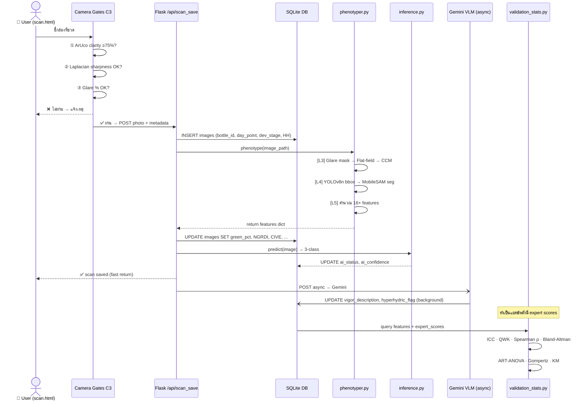

# VitroVision — Architecture Diagram v2

> สร้างจาก `_architecture_v2_final.md` (2026-06-21)
> ✅ = implement แล้ว · ⬜ = ยังไม่ implement · ⚠️ = รอ decision/ข้อมูล

---

## 🗺️ Overview — 8 Layers Data Flow

```mermaid
flowchart TD
    classDef done fill:#22c55e,color:#fff,stroke:#16a34a
    classDef todo fill:#f59e0b,color:#fff,stroke:#d97706
    classDef pending fill:#6b7280,color:#fff,stroke:#4b5563
    classDef layer fill:#1e293b,color:#f1f5f9,stroke:#334155,font-weight:bold

    subgraph L0["⚗️  L0 — PHYSICAL  (rig + protocol)"]
        direction LR
        P1["🧪 100 ขวดแยมแก้ว 125 mL\n5 สูตร × 20 ขวด\nA=MS · B=BAP1 · C=BAP5\nD=BAP5+NAA0.05 · E=IBA1"]
        P2["📷 Samsung S24 FE\nPro mode: WB ~4000K / ISO 50\nระยะ ~18 cm · 17:00 น. ทุกวัน"]
        P3["🏷️ ArUco DICT_4X4_100\n~3 cm/ขวด\n→ scale px→cm²"]
        P4["🎨 DIY 6-patch Color Target\nW · Gray 18% · R · G · B · Black\n⚠️ characterize ค่าก่อนใช้"]
        P5["🏠 ห้องเพาะ\n25±2°C · 16h/8h · LED 40-50 µmol/m²/s"]
    end

    subgraph L1["📱  L1 — DATA CAPTURE  (scan.html)"]
        direction LR
        C1["Camera Gates C3\n✅ ArUco clarity ≥ 75%\n⬜ Laplacian sharpness gate\n⬜ Glare detection gate\n⬜ Torch auto-on\n⬜ Grid overlay"]
        C2["FormData → /api/scan_save\nbottle_id · day_point · clarity\n✅ dev_stage  GAP-4\n✅ hyperhydricity  GAP-5"]
    end

    subgraph L2["🗄️  L2 — STORAGE  (vitroshelf.db)"]
        direction LR
        S1["SQLite — shelf_manager/database.py\nbatches · bottles · images\ngrowth_observations\n✅ expert_scores  GAP-1\n⬜ acclim_survival  GAP-2"]
        S2["☁️ Google Drive\nbackup-only Q3\ndegrade gracefully ≠ block scan"]
    end

    subgraph L3["🎨  L3 — COLOR CORRECTION  (phenotyper.py) — NEW v2"]
        direction LR
        CC1["①  Glare Mask\nHSV adaptive V-high + S-low\n→ MASK-OUT ไม่ inpaint\n→ specular_fraction feature"]
        CC2["②  Flat-field\nหาร flat frame ของ rig\n→ แก้ non-uniform illumination"]
        CC3["③  CCM affine 3×3\nPlantCV auto_correct_color\n⚠️ ต้องก่อน index ทุกครั้ง\nห้าม Polynomial CCM"]
        CC1 --> CC2 --> CC3
    end

    subgraph L4["✂️  L4 — SEGMENTATION  (v2 — เปลี่ยน engine)"]
        direction TB
        SEG1["🏭 Production\nYOLOv8n  →  bbox\nMobileSAM box-prompt\ninstance seg 3-class\nleaf / shoot / stem\n✅ CPU-capable 8GB RAM"]
        SEG2["🔬 Pre-annotation offline\nGroundingDINO zero-shot bbox\n→ training data YOLOv8n-seg\nรัน offline ครั้งเดียว"]
        SEG3["🔄 Fallback\nHSV green threshold\n(ถ้า model ไม่ available)"]
        SCALE["📐 ArUco scale\nmarker_side_px ต่อภาพ\n→ px/cm ratio\n→ area_cm² / height_mm"]
        SEG1 --- SEG3
        SEG2 -.->|fine-tune| SEG1
    end

    subgraph L5["📊  L5 — FEATURE EXTRACTION  (phenotyper.py → 16+ features)"]
        direction LR
        F1["🌿 Color Indices  ✳️ ต้องหลัง CCM\ngreen_coverage_pct  ★ primary\nNGRDI = G-R/G+R  🥇 เพิ่ม v2\nExG = 2G-R-B\nExR = 1.4R-G\nCIVE  🆕\nVARI = G-R/G+R-B\nLCI\nbrown_coverage_pct"]
        F2["🔲 Texture\nGLCM contrast / homogeneity / correlation\n32-64 bins discretize\nLBP  🆕"]
        F3["🌱 Architecture\nshoot_count / explant  🆕  จาก L4\nplant_area_cm²  ← ArUco scale\nconvex_hull_ratio\n❌ perimeter  ตัดออก ICC=0.27"]
        F4["✨ Quality\nspecular_fraction  🆕\n= glare area / total"]
    end

    subgraph L6["🤖  L6 — AI CLASSIFICATION  (qualitative · async)"]
        direction TB
        AI1["🖥️ Local DL Classifier\nshelf_manager/inference.py\ntimm: EfficientNet-B0 baseline\n→ upgrade DINOv2 หลัง labeled data\n3-class: healthy / contaminated / dead"]
        AI2["☁️ Gemini VLM  async\nshelf_manager/vision_analyzer.py\ngemini-3.5-flash\nOUTPUT qualitative only:\n• status: healthy/contam/dead\n• vigor_description: string\n• dev_stage\n• hyperhydric_flag: bool\n⚠️ ห้าม VLM ออกเลข vigor 1-5"]
        AI3["🔄 Pseudo-label Loop\nvitro_vision/pseudo_labeler.py\nGemini teacher\n→ human review\n→ commit → train DINOv2"]
        AI1 --- AI2
        AI2 -.->|pseudo labels| AI3
        AI3 -.->|labeled data| AI1
    end

    subgraph L7["📈  L7 — ANALYSIS & VALIDATION  (validation_stats.py) — NEW v2"]
        direction LR
        V1["Module 1 — Inter-rater IRR\nICC(2,1) ≥ 0.75 threshold\nQWK vigor-rubric ≥ 0.61\nKrippendorff α ≥3 rater\nCohen κ binary hyperhydric"]
        V2["Module 2 — CV vs Expert\nSpearman ρ ≥ 0.80\nBland-Altman bias + LoA\n95% CI bootstrap"]
        V3["Module 3 — Treatment\nART-ANOVA → ART-C\nε²p effect size\npost-hoc: ART-C ❌ ห้าม Dunn"]
        V4["Module 4 — Growth Curve\nGompertz NLS ต่อขวด\nK · k · tm · AUC · lag_period\nLMM สูตร A–E\nref: Depetris 2025"]
        V5["Module 5 — Survival/Contam\nKM + permutation log-rank\nCIF competing risks"]
    end

    subgraph INFRA["🌐  Infrastructure — Flask Web App  port 5001"]
        direction LR
        W1["shelf_manager/main.py\nVitroVision.bat"]
        W2["scan.html · bottle.html\nanalytics.html · train.html\n⬜ manifest.json PWA\n⬜ rate-of-change column"]
    end

    %% Main data flow
    L0 -->|"กล้อง + rig"| L1
    L1 -->|"POST /api/scan_save"| L2
    L2 -->|"raw image path"| L3
    L3 -->|"corrected image"| L4
    L4 -->|"masks + scale"| L5
    L5 -->|"16+ features"| L2
    L5 -->|"features"| L7
    L5 -->|"image"| L6
    L6 -->|"3-class label"| L2
    L6 -.->|"async update"| L2
    L2 -->|"DB query"| L7
    INFRA -.-|"routes + templates"| L1
    INFRA -.-|"routes + templates"| L2
    INFRA -.-|"routes + templates"| L6
    INFRA -.-|"display"| L7
```

---

## 🔄 Single-Image Processing Flow

---

## 📦 File → Layer Map

| Layer | ไฟล์หลัก | สถานะ |
|---|---|---|
| L0 Physical | `aruco_stickers.pdf` · rig manual | ✅ ArUco ติดครบ |
| L1 Capture | `templates/scan.html` | ✅ dev_stage + HH · ⬜ C3 gates |
| L2 Storage | `shelf_manager/database.py` · `vitroshelf.db` | ✅ expert_scores · ⬜ survival |
| L3 Color | `shelf_manager/phenotyper.py` | ✅ glare mask · ⬜ flat-field · ⬜ CCM |
| L4 Seg | `vitro_vision/detector.py` + `phenotyper.py` | ⬜ MobileSAM · ⬜ GroundingDINO |
| L5 Features | `shelf_manager/phenotyper.py` | ✅ NGRDI/CIVE/ExG/VARI/GLCM/specular · ⬜ ArUco scale |
| L6 AI | `shelf_manager/inference.py` · `vision_analyzer.py` | ⬜ Gemini async |
| L7 Stats | `vitro_vision/validation_stats.py` | ⬜ ต้องเขียนใหม่ทั้งหมด |
| Infra | `shelf_manager/main.py` · `VitroVision.bat` | ✅ รันได้ · ⬜ PWA |

---

## ⚠️ Decision ที่ยังค้าง

| Decision | รอ |
|---|---|
| A5.1 Cross-polarizer vs Diffuse light-tent | เทสต์ day 0 batch 1 |
| A3 HSV threshold calibration | ภาพ calibration จาก rig จริง |
| T1 Bridge study | implement ก่อน collect validation |

---

*อัปเดต: 2026-06-22 · อิง `_architecture_v2_final.md` (2026-06-21)*
